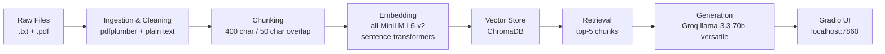

# Project 1 Planning: The Unofficial Guide

> Write this document before you write any pipeline code.
> Your spec and architecture diagram are what you'll use to direct AI tools (Claude, Copilot, etc.) to generate your implementation — the more specific they are, the more useful the generated code will be.
> Update the Retrieval Approach and Chunking Strategy sections if you change your approach during implementation.
> Update this file before starting any stretch features.

---

## Domain

Rutgers University campus dining: student opinions on dining halls, meal plans, 
and food locations. This knowledge is valuable because official sources only show 
menus and hours, not honest student experiences like which halls are overcrowded, 
which food is consistently bad, or which meal swipe locations give the best value.

---

## Documents

| # | Source | Description | URL or location |
|---|--------|-------------|-----------------|
| 1 | Reddit r/rutgers | "Is Rutgers food that bad?" thread | Is_Rutgers_food_that_bad.txt |
| 2 | Reddit r/rutgers | Dining hall guide for freshmen | Guide_to_dining_halls.txt |
| 3 | Reddit r/rutgers | Meal swipe location tier list | Meal_Swipe_Location_Tier_List.txt |
| 4 | Reddit r/rutgers | "What meal plan do yall recommend?" thread | What_meal_plan_do_Yall_recommend.txt |
| 5 | Reddit r/rutgers | "How's food at Rutgers?" thread | How_s_food_at_Rutgers.txt |
| 6 | Reddit r/rutgers | "Busch Dining Hall is Best" thread | Busch_Dining_Hall_Is_Best_I_Will_Di.txt |
| 7 | Reddit r/rutgers | Summer dining hours announcement | Summer_dining_hours_begin_Thursday_.txt |
| 8 | Google Reviews | Student reviews of Neilson Dining Hall | Salma_Mukhtar.txt |
| 9 | Rutgers Dining / Nutrislice | Official June 2026 menu for Livingston Dining | Nutrislice___Rutgers_University.pdf |
| 10 | Rutgers Dining / Nutrislice | Official June 2026 menu for Busch Dining Hall | Nutrislice-livingston__Rutgers_University.pdf |
---

## Chunking Strategy

**Chunk size:** 400 characters
**Overlap:** 50 characters
**Reasoning:** Documents are mostly short Reddit comments and reviews, so 400 characters captures one complete opinion without merging unrelated comments together.

---

## Retrieval Approach

**Embedding model:** all-MiniLM-L6-v2
**Top-k:** 5
**Production tradeoff reflection:** For a real deployment, I would consider switching to a larger model like text-embedding-3-small from OpenAI, which has better accuracy on informal text like Reddit comments. Tradeoffs to weigh would be: cost (API calls vs 
free local model), latency (cloud vs running locally), and context length (some reviews are long and a model with larger context window would handle them better). For a Rutgers-specific system, domain accuracy matters most, so a larger model would be worth the cost.

---

## Evaluation Plan

| # | Question | Expected answer |
|---|----------|-----------------|
| 1 | Which dining hall do students consider the best at Rutgers? | Livingston Dining Hall is most frequently cited as the best, praised for its burger bar, pasta line, Mongolian grill, and variety of options. |
| 2 | What meal plan should a freshman get? | The 210 plan is recommended as the minimum. It averages 2 swipes per day and accounts for days you eat out or skip meals. |
| 3 | What makes Henry's Diner worth using a meal swipe on? | Students describe it as a real Jersey diner experience, sit-down service, great food quality, and worth the wait. It is ranked S-tier for meal swipe value. |
| 4 | What are student complaints about the Atrium on College Ave? | Students say the food is oily and processed, hard to eat frequently, and at least one student reported getting food poisoning there. Portion sizes are also described as too large. |
| 5 | What food stations are available at Livingston Dining Hall? | Livingston has a burger bar, pasta line, Mongolian/hibachi grill, pizza bar, salad bar, Asian dishes, and a waffle station at breakfast. |

---

## Anticipated Challenges

1. The Nutrislice PDF menus are mostly repeated lists of food items across dates, which will produce many nearly identical chunks. This could flood retrieval results with menu data when a student asks an opinion-based question, drowning out the more useful Reddit/review content.

2. Reddit comments are informal and inconsistent.Some are one sentence, others are several paragraphs. A fixed 400-character chunk size may cut a long detailed comment mid-thought, splitting key information across chunk boundaries and making it harder to retrieve complete opinions.

---

## Architecture

---

## AI Tool Plan

**Milestone 3 — Ingestion and chunking:**
I'll give Claude my Documents section and Chunking Strategy section and ask it to implement an ingest.py script that loads .txt files with plain text and .pdf files with pdfplumber, cleans them, and splits them into 400-character chunks with 50-character overlap. I'll verify by printing 5 random chunks and checking they are readable and complete.

**Milestone 4 — Embedding and retrieval:**
I'll give Claude my Retrieval Approach section and architecture diagram and ask it to implement embed.py that embeds chunks using all-MiniLM-L6-v2 and stores them in ChromaDB with source metadata. I'll verify by running 3 test queries and checking that returned chunks are relevant.

**Milestone 5 — Generation and interface:**
I'll give Claude my full planning.md and ask it to implement a Gradio app that takes a user query, retrieves top-5 chunks from ChromaDB, passes them to Groq llama-3.3-70b with a grounding prompt, and returns an answer with source citations. I'll verify that asking an out-of-scope question returns a refusal rather than a hallucinated answer.